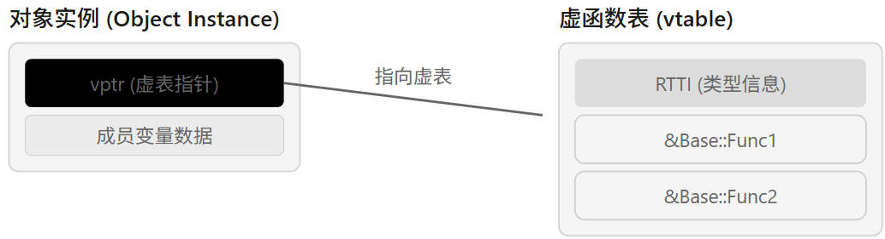

## 定义

虚函数（virtual function）是在基类中用`virtual`声明的成员函数，允许派生类重写。并在通过基类指针/引用调用时，按对象的真实类型在运行时决定调用哪个版本。

> 虚函数在[设计模式](https://zh.wikipedia.org/wiki/%E8%AE%BE%E8%AE%A1%E6%A8%A1%E5%BC%8F_(%E8%AE%A1%E7%AE%97%E6%9C%BA)) "设计模式 (计算机)")方面扮演重要角色。例如，《设计模式》一书中提到的23种设计模式中，仅5个对象创建模式就有4个用到了虚函数（[抽象工厂](https://zh.wikipedia.org/wiki/%E6%8A%BD%E8%B1%A1%E5%B7%A5%E5%8E%82%E6%A8%A1%E5%BC%8F "抽象工厂模式")、[工厂方法](https://zh.wikipedia.org/wiki/%E5%B7%A5%E5%8E%82%E6%96%B9%E6%B3%95%E6%A8%A1%E5%BC%8F "工厂方法模式")、[建造者](https://zh.wikipedia.org/wiki/%E5%BB%BA%E9%80%A0%E8%80%85%E6%A8%A1%E5%BC%8F "建造者模式")、[原型](https://zh.wikipedia.org/wiki/%E5%8E%9F%E5%9E%8B%E6%A8%A1%E5%BC%8F "原型模式")），只有[单例](https://zh.wikipedia.org/wiki/%E5%8D%95%E4%BE%8B%E6%A8%A1%E5%BC%8F "单例模式")没有用到。[1]

## 本质

本质是运行时多态（动态绑定），不是编译期静态绑定。
让我们来看个例子，何谓运行期绑定，何谓编译期绑定。

```cpp
#include <iostream>
using namespace std;

class Base {
public:
    void f1() { cout << "Base::f1 (non-virtual)\n"; }      // 编译期绑定
    virtual void f2() { cout << "Base::f2 (virtual)\n"; }  // 运行期绑定
};

class Derived : public Base {
public:
    void f1() { cout << "Derived::f1 (non-virtual)\n"; }   // 隐藏基类同名函数
    void f2() override { cout << "Derived::f2 (virtual)\n"; }
};

int main() {
    Derived d;
    Base* p = &d;   // 基类指针指向子类对象

    p->f1(); // Base::f1  -> 编译期按指针类型 Base* 决定
    p->f2(); // Derived::f2 -> 运行期按对象真实类型 Derived 决定
}
```

在上面的代码示例中，带`virtual`的f2函数具备运行期绑定能力。

为理解虚函数的底层原理，我们再来看一个例子。[1]

```cpp
# include <iostream>
# include <vector>

using namespace std;
class Animal
{
public:
    virtual void eat() const { cout << "I eat like a generic Animal." << endl; }
    virtual ~Animal() {}
};
 
class Wolf : public Animal
{
public:
    void eat() const { cout << "I eat like a wolf!" << endl; }
};
 
class Fish : public Animal
{
public:
    void eat() const { cout << "I eat like a fish!" << endl; }
};
 
class GoldFish : public Fish
{
public:
    void eat() const { cout << "I eat like a goldfish!" << endl; }
};
 
 
class OtherAnimal : public Animal
{
};
 
int main()
{
    std::vector<Animal*> animals;
    animals.push_back( new Animal() );
    animals.push_back( new Wolf() );
    animals.push_back( new Fish() );
    animals.push_back( new GoldFish() );
    animals.push_back( new OtherAnimal() );
 
    for( std::vector<Animal*>::const_iterator it = animals.begin();
       it != animals.end(); ++it) 
    {
        (*it)->eat();
        delete *it;
    }
 
   return 0;
}
```

输出打印如下：

```
I eat like a generic Animal.
I eat like a wolf!
I eat like a fish!
I eat like a goldfish!
I eat like a generic Animal.
```

如果我们把`Animal::eat()`的virtual去掉，则输出打印如下：

```
I eat like a generic Animal.
I eat like a generic Animal.
I eat like a generic Animal.
I eat like a generic Animal.
I eat like a generic Animal.
```

## 虚函数指针和虚函数表

C++ 虚函数的底层原理可以概括为：编译器在类中生成一张虚函数表（vtable），并在每个对象实例中插入一个指向该表的虚表指针（vptr）。
编译器通常通过 `vptr + vtable` 机制实现（实现细节由编译器决定，但思想类似）：

* 对象里有一个隐藏指针 `vptr`，指向该类型的虚函数表 `vtable`
* `vtable` 里存放该类型对应的虚函数地址
* 调用虚函数时，根据对象当前的 `vptr` 去表里找函数地址再调用

所以：

```C++
Base* p = newDerived();
p->func();
```

虽然 `p` 是 `Base*`，但对象里的 `vptr` 指向 `Derived` 的 `vtable`，最终调用到 `Derived::func()`。



上面Animal类的例子中，虽然容器里全是 `Animal*`，但每个指针指向的实际对象不同。
每个对象内部的 `vptr` 也不同，分别指向 Animal/Wolf/Fish/GoldFish/OtherAnimal 各自的 vtable。

 `(*it)->eat()` 时发生什么 ?

编译器看到是虚函数调用，不直接写死 `Animal::eat`，而是“按对象的 `vptr` 去查表调用”：

* 指向 `Animal` 对象 -> `Animal::eat`
* 指向 `Wolf` 对象 -> `Wolf::eat`
* 指向 `Fish` 对象 -> `Fish::eat`
* 指向 `GoldFish` 对象 -> `GoldFish::eat`
* 指向 `OtherAnimal` 对象（没重写）-> 继承 `Animal::eat`

于是我们看到了多态输出。

`delete *it` 为什么安全 ？

因为 `Animal` 析构是 `virtual ~Animal()`，删除 `Animal*` 指向派生对象时，也会通过虚表走“正确析构链”（先派生再基类）。
如果这里不是虚析构，就有未定义行为风险。

## LET'S DEBUG

我们将上面的代码再扩展下，dumpVtable的功能是：把多态对象的动态类型、对象地址、vptr 地址和 vtable 前几个槽位地址打印出来，用于直观演示虚函数分派机制。

```cpp
# include <iostream>
# include <vector>
#include <typeinfo>

using namespace std;
class Animal
{
public:
    virtual void eat() const { cout << "I eat like a generic Animal." << endl; }
    virtual ~Animal() {}
};
 
class Wolf : public Animal
{
public:
    void eat() const { cout << "I eat like a wolf!" << endl; }
};
 
class Fish : public Animal
{
public:
    void eat() const { cout << "I eat like a fish!" << endl; }
};
 
class GoldFish : public Fish
{
public:
    void eat() const { cout << "I eat like a goldfish!" << endl; }
};
 
 
class OtherAnimal : public Animal
{
};

void dumpVtable(Animal* p, const char* tag, int slots = 3) {
    // 假设单继承场景下 vptr 在对象起始处（主流 ABI 常见）
    void** vptr = *reinterpret_cast<void***>(p);
    std::cout << "\n[" << tag << "] dynamic type: " << typeid(*p).name() << "\n";
    std::cout << "  obj  = " << p << "\n";
    std::cout << "  vptr = " << vptr << "\n";
    for (int i = 0; i < slots; ++i) {
        std::cout << "  vtable[" << i << "] = " << vptr[i] << "\n";
    }
}
 
int main()
{
    std::vector<Animal*> animals;
    animals.push_back( new Animal() );
    animals.push_back( new Wolf() );
    animals.push_back( new Fish() );
    animals.push_back( new GoldFish() );
    animals.push_back( new OtherAnimal() );
 
    for( std::vector<Animal*>::const_iterator it = animals.begin();
       it != animals.end(); ++it) 
    {
        dumpVtable(*it, "before eat");
        (*it)->eat();
        delete *it;
    }
 
   return 0;
}
```

先看输出

```
[before eat] dynamic type: 6Animal
  obj  = 0x5c3b7c357eb0
  vptr = 0x5c3b66ae1ca0
  vtable[0] = 0x5c3b66add7b8
  vtable[1] = 0x5c3b66add7f6
  vtable[2] = 0x5c3b66add814
I eat like a generic Animal.

[before eat] dynamic type: 4Wolf
  obj  = 0x5c3b7c357ef0
  vptr = 0x5c3b66ae1c78
  vtable[0] = 0x5c3b66add844
  vtable[1] = 0x5c3b66ade834
  vtable[2] = 0x5c3b66ade862
I eat like a wolf!

[before eat] dynamic type: 4Fish
  obj  = 0x5c3b7c357ed0
  vptr = 0x5c3b66ae1c50
  vtable[0] = 0x5c3b66add882
  vtable[1] = 0x5c3b66add9d8
  vtable[2] = 0x5c3b66adda06
I eat like a fish!

[before eat] dynamic type: 8GoldFish
  obj  = 0x5c3b7c357f10
  vptr = 0x5c3b66ae1c28
  vtable[0] = 0x5c3b66add8c0
  vtable[1] = 0x5c3b66ade7d6
  vtable[2] = 0x5c3b66ade804
I eat like a goldfish!

[before eat] dynamic type: 11OtherAnimal
  obj  = 0x5c3b7c357f60
  vptr = 0x5c3b66ae1c00
  vtable[0] = 0x5c3b66add7b8
  vtable[1] = 0x5c3b66ade778
  vtable[2] = 0x5c3b66ade7a6
I eat like a generic Animal.
```

可以看到Animal/Wolf/Fish/GoldFish/OtherAnimal不同动态类型通常 vptr 不同，从而虚调用会分派到不同实现。
OtherAnimal 没 override 时，某些槽位会和 Animal 对应实现一致（地址层面常可观察到）。

如果不用附加的打印函数，也可以使用gdb观察相应内存，如

```shell
(gdb) set $p = animals[3]              # 比如 GoldFish*
(gdb) p/x $p                           # 对象地址
(gdb) p/x *(void**)$p                  # 对象头里的 vptr
(gdb) set $vt = (void**)*(void**)$p    # vtable 起点
(gdb) p/x $vt[0]
(gdb) p/x $vt[1]
(gdb) p/x $vt[2]
```

## 常见问题

关于 C++ 虚函数和多态，面试官非常喜欢考察底层实现细节。以下是几个最经典的问题，涵盖从表面到内核的各个层面：

---

### 1. 为什么要使用虚函数？它解决了什么问题？
**考点**：多态的实现原理与动态绑定的意义。
*   **标准答案**：虚函数是实现**运行时多态**（Run-time Polymorphism）的基础。它允许通过基类指针或引用调用子类的实现，使程序具有“泛化”的能力。
*   **关键点**：如果不用虚函数，我们只能做到编译时多态（如模板或函数重载），无法做到根据对象的实际类型来决定行为。

---

### 2. C++ 多态的分类有哪些？
**考点**：对多态概念的宏观理解。
*   **编译时多态（静多态）**：通过函数重载（Overload）和运算符重载实现，编译器直接决定调用哪个版本。
*   **运行时多态（动多态）**：通过虚函数（Virtual）实现，程序运行到调用点时才根据对象类型查找虚表确定目标函数。

---

### 3. 构造函数能定义为虚函数吗？为什么？
**考点**：对 `vptr` 初始化过程的理解。
*   **答案**：**不能**。
*   **原因**：对象在构造之前是不存在的，内存都没分配，自然也没有 `vptr`。更重要的是，只有在构造函数执行完毕后，`vptr` 才会被正确指向当前类的虚表。如果在构造过程中就把函数设为虚函数，会导致寻找不存在的虚表。

---

### 4. 析构函数为什么要声明为虚函数？
**考点**：资源管理与内存泄漏。
*   **场景**：如果基类指针指向派生类对象并删除（`delete ptr`），而基类的析构函数不是虚函数，那么只会调用基类的析构函数，导致派生类特有的资源（如 `new` 出来的内存）没有被释放。
*   **原则**：在多态设计中，**基类的析构函数通常应该声明为虚函数（甚至纯虚）**。

---

### 5. 什么是“虚表指针偏移”？如何手动获取虚函数地址？
**考点**：内存模型底层操作。
*   **问题**：如果一个类有 3 个虚函数，它们的地址在内存中是按什么顺序排列的？
*   **回答**：通常是按声明顺序或子类优先原则排列。子类重写的方法地址会覆盖掉父类在对应索引位置上的地址。
*   **代码技巧**：通过 `*(long*)obj` 获取 `vptr`，再通过 `((void**)vptr)[i]` 获取第 `i` 个虚函数的地址。

---

### 6. 什么是“菱形继承”？虚继承解决了什么？
**考点**：多重继承下的歧义与虚表机制。
*   **场景**：`B` 和 `C` 都继承自 `A`，`D` 同时继承自 `B` 和 `C`。如果不加处理，`D` 中会有两份 `A` 的成员，且调用 `A` 的方法会产生二义性。
*   **虚继承**：关键字 `virtual`。虚继承会引入一个**虚基类指针（vbptr）**，它指向虚基类表（vbtable），通过相对偏移量来确保无论继承多少层，子类中永远只有一份基类实例。

---

### 7. final 和 override 关键字的作用是什么？
**考点**：现代 C++ 的防错机制。
*   **override**：显式告知编译器该函数是重写父类的。如果父类没有对应虚函数，编译器会报错（防止拼写错误导致意外创建了新的虚函数）。
*   **final**：阻止后续子类再次重写该函数，或者阻止该类继续派生。

---

### 8. 动态多态的性能损耗有多大？
**考点**：性能优化意识。
*   **回答**：主要损耗在于**间接寻址**（查表跳转）。
*   **现代优化**：编译器可以使用 `Final Override` 提示进行**越界内联（Devirtualization）**优化。如果编译器发现某个虚函数在编译期已经知道具体指向且不会被子类改变，它会跳过虚表查找，直接调用。

---


## 扩展阅读

[1] https://zh.wikipedia.org/wiki/%E8%99%9A%E5%87%BD%E6%95%B0

[2] https://cppreference.cn/w/cpp/language/virtual