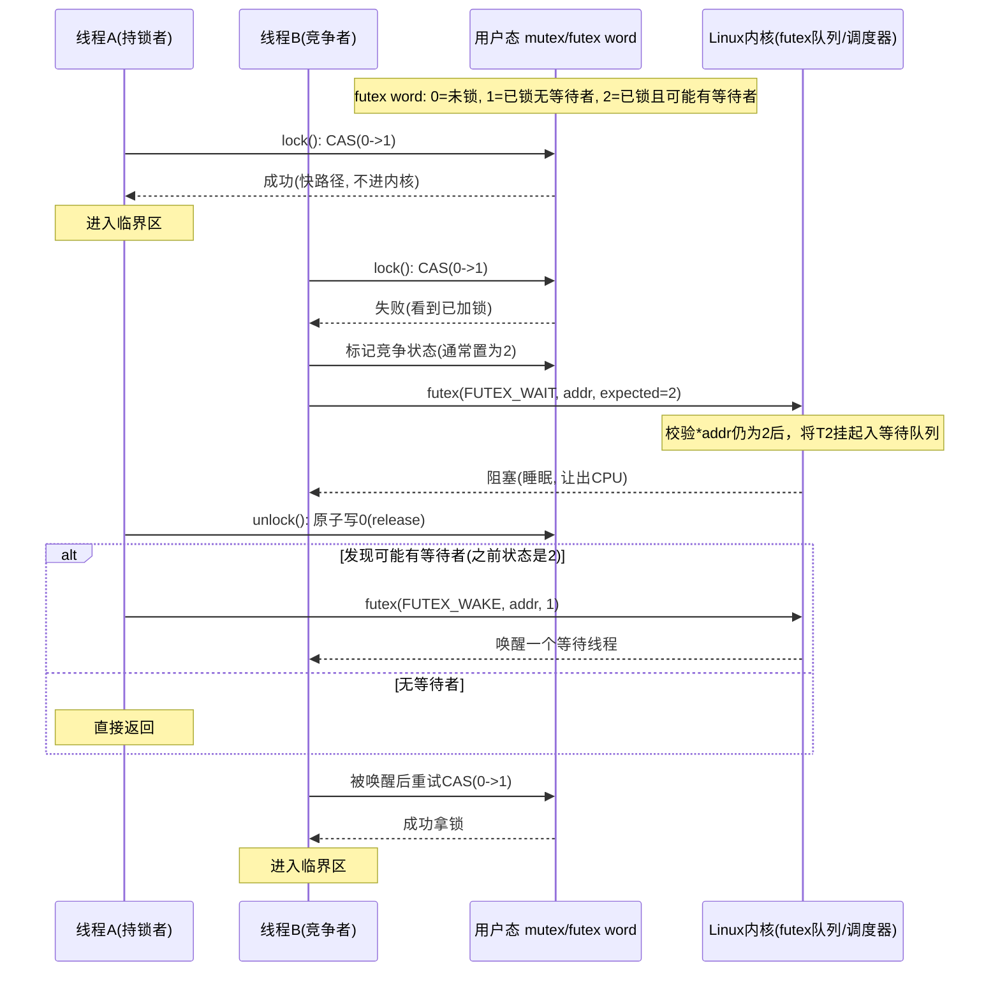
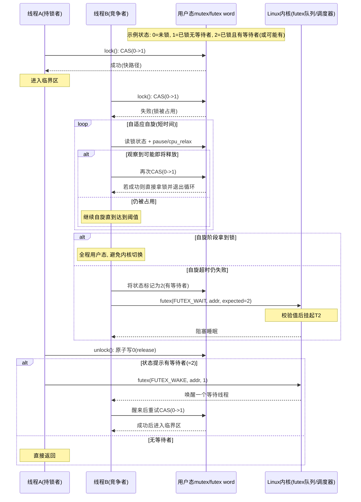

## 线程安全

从一个经典的面试题目开始：设计一个线程安全的队列。

何谓**线程安全**？
在多线程并发访问同一段代码或同一份数据时，程序的行为始终正确、结果可预期，不会因为执行顺序不同而出错。
为何会不安全：多个线程同时读取变量，操作不是原子的，缺少同步或可见性保证。
常见保证安全的方法：加锁（互斥锁，读写锁），使用原子操作，使用线程安全容器。

何谓**队列**？
队列（Queue）是一种先进先出（FIFO）的数据结构。可以理解为排队，新来的元素从队尾进入（入队），最早进入的元素从队头离开（出队）。
核心特点是只能在两端操作（队尾加，队头取）。
常见应用场景：如任务调度（打印任务，线程池任务），消息系统（生产者-消费者），广度优先搜索（BFS）。

### ThreadSafeQueue

线程安全的队列的一个经典实现，是基于`互斥量+Conditional Variable`的方案。这是最经典，最实用的方式，支持阻塞式消费。

```C++
#include <iostream>
#include <queue>
#include <mutex>
#include <condition_variable>
#include <thread>
#include <chrono>

template <typename T>
class BlockingQueue {
private:
  std::queue<T> queue_;
  mutable std::mutex mutex_;
  std::condition_variable cv_;

public:
  // 入队, push method 1
  void push(T value) {
    {
    	std::lock_guard<std::mutex> lock(mutex_);
    	queue_.push(std::move(value));
  	}
    cv_.notify_one(); // 唤醒一个等待的消费者
  }

  // 完美转发，支持就地构造 push method 2
  template <class... Args>
  void emplace(Args&&... args) {
    {
        std::lock_guard<std::mutex> lock(mutex_);
        queue_.emplace(std::forward<Args>(args)...);
    }
    cv_.notify_one();
  }

  // 出队（阻塞）pop method 1
  bool pop(T& value) {
    std::unique_lock<std::mutex> lock(mutex_);
    cv_.wait(lock, [this]() {return !queue_.empty();});

    value = std::move(queue_.front());
    queue_.pop();
    return true;
  }

  // 出队（超时）pop method 2
  bool popWithTimeout(T& value, std::chrono::milliseconds timeout) {
    std::unique_lock<std::mutex> lock(mutex_);
    if (!cv_.wait(lock, timeout, [this]() {return !queue_.empty(); })) {
      return false; // 超时
    }
    value = std::move(queue_.front());
    queue_.pop();
    return true;
  }

  // 出队（非阻塞尝试出队）pop method 3
  std::shared_ptr<T> tryPop() {
    std::lock_guard<std::mutex> lock(mutex_);
    if (queue_.empty()) {
      return nullptr; // 空队列，返回空指针
    }
    auto value = std::make_shared<T>(std::move(queue_.front()));
    queue_.pop();
    return value;
  }

  bool empty() const {
    std::lock_guard<std::mutex> lock(mutex_);
    return queue_.empty();
  }

  size_t size() const {
    std::lock_guard<std::mutex> lock(mutex_);
    return queue_.size();
  }
};
```

以上是一个典型的**线程安全队列**实例。线程安全的核心是：所有的`queue_`的读写都在同一把`mutex_`保护下完成，并用`condition_variable`实现“空队列等候，入队后唤醒”。

* `queue_`：共享数据（多个线程都会访问）
* `mutex_`：互斥锁，防止并发读写竞争
* `cv_`：条件变量，让消费者在“队列空”时阻塞等待

为什么线程安全（按函数看）：

* `Push`
  * 用 `lock_guard` 上锁后才 `queue_.push(...)`
  * 离开作用域自动解锁，再 `notify_one()` 唤醒等待线程
* `pop`
  * 用 `unique_lock` 上锁
  * `cv_.wait(lock, predicate)` 会在条件不满足时自动释放锁并睡眠；被唤醒后先重新拿锁，再检查条件
  * 条件满足后才取 `front` + `pop`
* `popWithTimeout`
  * 和 `pop` 同理，只是有超时返回
* `tryPop` / `empty` / `size`
  * 都在锁内访问 `queue_`，避免竞态

锁使用上几个关键点：

1. **同一把锁保护同一份共享状态**
   * 所有 `queue_` 访问都受 `mutex_` 保护，这是最基本的正确性前提。
2. `wait(lock, predicate)` **是正确写法**
   * 能处理“虚假唤醒”，不会因为被错误唤醒就去读空队列。
   * 等待期间会释放锁，避免阻塞生产者入队。
3. `notify_one()` **放在解锁后调用**
   * 先离开锁作用域再 `notify_one`，可减少被唤醒线程“立刻抢不到锁”的无效唤醒开销（性能上更优，语义也正确）。

**小结说明**

| 概念                          | 作用                             | 不用会怎样                            |
| ----------------------------- | -------------------------------- | ------------------------------------- |
| **`std::mutex`**              | 保护队列，防止并发读写竞态       | UB、数据损坏                          |
| **`std::unique_lock`**        | 可中途解锁，配合`wait()`         | 无法让 wait 释放锁                    |
| **`std::condition_variable`** | 高效等待（不忙等），比轮询省 CPU | 用 while(!empty()) 忙等会浪费大量 CPU |
| **谓词形式的 `wait`**         | 处理虚假唤醒                     | 可能取到空元素                        |
| **`std::move`**               | 避免拷贝，只移动语义             | 拷贝开销大，尤其对大对象              |
| **`emplace`**                 | 原地构造，减少中间对象           | 多一次构造+一次析构                   |

### 测试代码

```c++
int main() {
    BlockingQueue<int> queue;

    // 生产者
    std::thread producer([&queue]() {
        for (int i = 0; i < 10; i++) {
            queue.push(i);
            std::cout << "Producer pushed: " << i << std::endl;
            std::this_thread::sleep_for(std::chrono::milliseconds(100));
        }
        queue.push(-1); // 添加一个哨兵表示结束
    });

    // 消费者
    std::thread consumer([&queue]() {
        int value;
        while(true) {
            queue.pop(value);
            if(value == -1) {
                break;
            }
            std::cout << "Consumer poped: " << value << std::endl;
        }
    });

    producer.join();
    consumer.join();
    std::cout << "Done. Queue size: " << queue.size() << std::endl;
    return 0;
}
```

输出：

```
Producer pushed: 0
Consumer poped: 0
Producer pushed: 1
Consumer poped: 1
Producer pushed: 2
Consumer poped: 2
Producer pushed: 3
Consumer poped: 3
Producer pushed: 4
Consumer poped: 4
Producer pushed: 5
Consumer poped: 5
Producer pushed: 6
Consumer poped: 6
Producer pushed: 7
Consumer poped: 7
Producer pushed: 8
Consumer poped: 8
Producer pushed: 9
Consumer poped: 9
Done. Queue size: 0
```

C++ 多线程是高级开发、系统开发、网络通信、Linux后台开发中非常热门的面试方向。面试官通常会从 线程基础 → 同步机制 → 内存模型 → 性能优化 → 实战问题 逐层深入。

## mutex 的底层原理是什么

`mutex`(Mutual Exclusion，互斥锁)的本质是，保证某一时刻吸一个线程能够进入临界区（critical section）访问共享资源。
利用 CPU 的原子指令（CAS/LOCK CMPXCHG）保证只有一个线程获得锁；发生竞争时先短暂自旋，竞争严重时借助操作系统（Linux 上通常是 futex）把线程挂起和唤醒；同时通过内存屏障保证临界区数据对其他线程可见。

`mutex`在C++中是一个**用户态接口**,核心原理可以归纳为三层。

- 1）原子状态位（用户态已快路径）
  利用CPU原子指令（如CAS、xchg）尝试把锁从“未占用”改成“已占用”。
  成功：立即拿到锁，不陷入内核，开销很小。
  失败：说明已被别人持有，进入慢路径。
- 2）自旋 + 阻塞 （慢路径）
  竞争激烈时，线程不会一直忙等，通常是：
  先短暂自旋（spin），期待锁很快释放。
  仍拿不到就把线程挂起（park/sleep），交给内核调度，避免浪费CPU。Linux常见通过futex，只有冲突时才进入内核。
- 3）解锁与唤醒
  持锁线程`ulock`时
  原子地把状态改回"未占用"。
  若有等待者，唤醒一个或多个阻塞线程去竞争锁。（这一步也依赖内核同步原语）

为方便理解，可参考以下伪代码。

```c
lock():
    if CAS(state, 0, 1) succeeds: return  // 快路径
    spin a little                         // adptice spin
    mark_waiters(state = 2)
    futex_wait(&state, 2)                 // 慢路径睡眠
    retry CAS until success

unlock():
    state = 0 (release)
    if maybe_has_waiters:
        futex_wake(&state, 1)
```

下面是一张 **Linux `futex` 路径**下，`mutex` 从 `lock()` 到内核阻塞，再到 `unlock()` 唤醒的时序图（简化版）：



再给你一句“抓重点版”：

- **无竞争**：`CAS` 成功，纯用户态完成。
- **有竞争**：失败线程 `FUTEX_WAIT` 进内核睡眠。
- **释放锁**：`unlock` 发现有等待者就 `FUTEX_WAKE`，被唤醒线程再在用户态竞争锁。

下面是“带自旋（adaptive spin）”的时序图，把 `pthread_mutex` 常见的“先短自旋、再 futex 睡眠”也画进去。



这版里的 **adaptive spin** 关键点：

- 先“**短自旋**”赌持锁线程很快释放，减少睡眠/唤醒和上下文切换成本。
- 自旋次数/时长是“自适应”的：和平台、mutex 类型、竞争情况有关。
- 超过阈值就走 `futex WAIT`，避免一直空转烧 CPU。
- 被 `WAKE` 唤醒后仍要重新 CAS 竞争，唤醒不等于直接拥有锁。

上面的流程图，看上去特别地复杂和难记。我们需要记住以下关键原则：
**先在用户态抢；抢不到再睡；释放时唤醒。**
把它类比为停车场：

- 门口没人（无竞争） --> 直接进(CAS 成功)
- 有人占着（竞争）→ 先在门口短等几秒（自旋，踱步。将自旋理解为踱步是不是好容易理解了！）
- 还不行 → 去休息区等叫号（futex WAIT 睡眠）
- 出门的人通知下一个等待者（futex WAKE）

锁底层通常分为三层实现。

- C++标准库层：std::mutex只是接口封装 （libstdc++ / libc++）
- C运行库层：pthread_mutex_lock/unlock (gblic或musl)
- 内核层：竞争时才通过ftux系统调用进入Linux内核
  再往下还有**CPU指令层*，CAS、xchg、内存屏障，由硬件保证原子性和可见性。

最后让我们用一个直观的demo程序来理解`std::mutex` 竞争 demo（Linux）。
它支持两种模式：

* `low`：低竞争（大部分时间在锁外做事）
* `high`：高竞争（频繁抢锁）

高竞争时用 `strace` 能明显看到 `futex` 的 `WAIT/WAKE`。

```c++
#include <atomic>
#include <chrono>
#include <cstdlib>
#include <iostream>
#include <mutex>
#include <string>
#include <thread>
#include <vector>

using namespace std::chrono_literals;

struct Config {
    std::string mode = "high"; // high | low
    int threads = 4;
    int seconds = 5;
};

Config parse_args(int argc, char** argv) {
    Config cfg;
    if (argc > 1) cfg.mode = argv[1];
    if (argc > 2) cfg.threads = std::max(1, std::atoi(argv[2]));
    if (argc > 3) cfg.seconds = std::max(1, std::atoi(argv[3]));
    return cfg;
}

int main(int argc, char** argv) {
    Config cfg = parse_args(argc, argv);

    if (cfg.mode != "high" && cfg.mode != "low") {
        std::cerr << "Usage: " << argv[0] << " [high|low] [threads] [seconds]\n";
        return 1;
    }

    std::mutex mtx;
    std::atomic<bool> stop{false};
    std::atomic<long long> total_ops{0};
    long long shared_counter = 0;

    auto worker = [&](int /*id*/) {
        long long local_ops = 0;

        while (!stop.load(std::memory_order_relaxed)) {
            if (cfg.mode == "low") {
                // 锁外做点事，降低竞争概率
                std::this_thread::sleep_for(200us);
            }

            {
                std::lock_guard<std::mutex> lock(mtx);
                // 临界区尽量短：只做共享数据更新
                ++shared_counter;
            }

            ++local_ops;

            if (cfg.mode == "high") {
                // 高竞争模式：几乎不停抢锁
                // 不sleep，增加冲突概率
            }
        }

        total_ops.fetch_add(local_ops, std::memory_order_relaxed);
    };

    std::vector<std::thread> pool;
    pool.reserve(cfg.threads);

    auto start = std::chrono::steady_clock::now();
    for (int i = 0; i < cfg.threads; ++i) {
        pool.emplace_back(worker, i);
    }

    std::this_thread::sleep_for(std::chrono::seconds(cfg.seconds));
    stop.store(true, std::memory_order_relaxed);

    for (auto& t : pool) t.join();
    auto end = std::chrono::steady_clock::now();

    double elapsed = std::chrono::duration<double>(end - start).count();
    long long ops = total_ops.load(std::memory_order_relaxed);

    std::cout << "Mode            : " << cfg.mode << "\n";
    std::cout << "Threads         : " << cfg.threads << "\n";
    std::cout << "Duration (s)    : " << elapsed << "\n";
    std::cout << "Total lock ops  : " << ops << "\n";
    std::cout << "Ops/sec         : " << (ops / elapsed) << "\n";
    std::cout << "Shared counter  : " << shared_counter << "\n";

    return 0;
}
```

为验证“竞争时会走 futex 内核路径”，建议这样对比：

* `strace -f -c -e futex ./a.out low 4 5`
* `strace -f -c -e futex ./a.out high 4 5`

看汇总里 `futex` 调用次数/占比。通常会看到 `high` 明显更多。

```
ximen@N-5CG2435GBY:~/learn$ g++ -O2 -std=c++17 -pthread mutex_demo.cpp
ximen@N-5CG2435GBY:~/learn$ strace -f -c -e futex ./a.out low 4 5
strace: Process 1094 attached
strace: Process 1095 attached
strace: Process 1096 attached
strace: Process 1097 attached
Mode            : low
Threads         : 4
Duration (s)    : 5.00653
Total lock ops  : 52953
Ops/sec         : 10576.8
Shared counter  : 52953
% time     seconds  usecs/call     calls    errors syscall
------ ----------- ----------- --------- --------- ----------------
100.00    0.007275          66       110         5 futex
------ ----------- ----------- --------- --------- ----------------
100.00    0.007275          66       110         5 total
ximen@N-5CG2435GBY:~/learn$ strace -f -c -e futex ./a.out high 4 5
strace: Process 1157 attached
strace: Process 1158 attached
strace: Process 1159 attached
strace: Process 1160 attached
Mode            : high
Threads         : 4
Duration (s)    : 5.00376
Total lock ops  : 88281098
Ops/sec         : 1.76429e+07
Shared counter  : 88281098
% time     seconds  usecs/call     calls    errors syscall
------ ----------- ----------- --------- --------- ----------------
100.00    7.269695          38    187704     56568 futex
------ ----------- ----------- --------- --------- ----------------
100.00    7.269695          38    187704     56568 total
```

从输出可以看到：

- low 模式：futex 只有 110 次
- high 模式：futex 达到 187704 次
  这说明在 high 竞争场景下，线程大量走了“抢不到锁 → futex WAIT 睡眠 / futex WAKE 唤醒”的内核慢路径；而 low 基本停留在用户态快路径（CAS + 少量系统调用）。

## 什么是死锁

死锁（deadlock）是指，多个线程/进程互相等待对方持有的资源，导致大家都永远无法继续执行。
以最常见的两个锁例子为例。

- 线程A先拿到`mutex1`，再等`mutex2`
- 线程B先拿到`mutex2`，再等`mutex1`
- 双方都不释放自己已有的锁，因为都在等对方。

死锁产生的四个必要条件？
经典形成条件（Coffman条件，通常需同时满足才会死锁）

- **互斥**: 资源一次只能给一个线程用
- **占有并等待**：拿着一个资源，还在等其他资源
- **不何抢占**： 资源不能被强行夺走，只能主动释放
- **循环等待**： A等B,B等C,...,最后又回到A

如何避免死锁？

- 给所有锁规定**统一加锁顺序** （最有效）
- 尽量缩小临界区，减少“持锁时间”
- 用`std::scoped_lock`一次性锁多个互斥量（避免手写顺序错误）
- 使用`try_lock`+超时/回退策略，避免无限等待
- 在代码审查从专门检查“多锁嵌套”路径

以下是一个发生死锁的代码例子：

```c++
// deadlock_demo.cpp
#include <condition_variable>
#include <iostream>
#include <mutex>
#include <thread>

std::mutex m1, m2;           // 业务锁（故意制造死锁）
std::mutex sync_m;           // 仅用于同步演示步骤
std::condition_variable cv;
bool a_has_m1 = false;
bool b_has_m2 = false;

void threadA() {
    std::lock_guard<std::mutex> lk1(m1);
    std::cout << "A: got m1\n";

    {
        std::lock_guard<std::mutex> g(sync_m);
        a_has_m1 = true;
    }
    cv.notify_all();

    // 等待B先拿到m2（注意：A一直持有m1）
    {
        std::unique_lock<std::mutex> u(sync_m);
        cv.wait(u, [] { return b_has_m2; });
    }

    std::cout << "A: now trying m2 (will block)\n";
    std::lock_guard<std::mutex> lk2(m2); // 这里会卡住
    std::cout << "A: unreachable\n";
}

void threadB() {
    std::lock_guard<std::mutex> lk2(m2);
    std::cout << "B: got m2\n";

    {
        std::lock_guard<std::mutex> g(sync_m);
        b_has_m2 = true;
    }
    cv.notify_all();

    // 等待A先拿到m1（注意：B一直持有m2）
    {
        std::unique_lock<std::mutex> u(sync_m);
        cv.wait(u, [] { return a_has_m1; });
    }

    std::cout << "B: now trying m1 (will block)\n";
    std::lock_guard<std::mutex> lk1(m1); // 这里会卡住
    std::cout << "B: unreachable\n";
}

int main() {
    std::thread a(threadA);
    std::thread b(threadB);

    a.join(); // 永远等不到
    b.join(); // 永远等不到
    return 0;
}
```

输出

```
A: got m1
B: got m2
B: now trying m1 (will block)
A: now trying m2 (will block)
# 一直卡住（笔者注）
```

为避免死锁，可使用**统一加锁顺序**的方法

```c++
#include <chrono>
#include <iostream>
#include <mutex>
#include <thread>

std::mutex m1, m2;

// 统一顺序加锁：按地址排序后再加锁
void lock_in_global_order(std::mutex& a, std::mutex& b) {
    std::mutex* first = &a;
    std::mutex* second = &b;
    if (first > second) std::swap(first, second);

    first->lock();
    second->lock();
}

void unlock_pair(std::mutex& a, std::mutex& b) {
    // 解锁顺序通常反过来（不是必须，但习惯上更清晰）
    std::mutex* first = &a;
    std::mutex* second = &b;
    if (first > second) std::swap(first, second);

    second->unlock();
    first->unlock();
}

void workerA() {
    for (int i = 0; i < 5; ++i) {
        // A 逻辑上想先拿 m1 再拿 m2
        lock_in_global_order(m1, m2);
        std::cout << "A in critical section, i=" << i << "\n";
        std::this_thread::sleep_for(std::chrono::milliseconds(30));
        unlock_pair(m1, m2);
    }
}

void workerB() {
    for (int i = 0; i < 5; ++i) {
        // B 逻辑上想先拿 m2 再拿 m1（与A相反）
        // 但实际仍会被 lock_in_global_order 统一成同一顺序
        lock_in_global_order(m2, m1);
        std::cout << "B in critical section, i=" << i << "\n";
        std::this_thread::sleep_for(std::chrono::milliseconds(30));
        unlock_pair(m2, m1);
    }
}

int main() {
    std::thread t1(workerA);
    std::thread t2(workerB);

    t1.join();
    t2.join();

    std::cout << "Finished without deadlock.\n";
    return 0;
}
```

工程里更推荐直接用标准库一次锁多个 mutex：
`std::scoped_lock lock(m1, m2);`
它本质上就是帮你做“避免死锁的统一获取策略”，更不容易写错。

```c++
#include <chrono>
#include <iostream>
#include <mutex>
#include <thread>

std::mutex m1, m2;

void worker(const char* name) {
    for (int i = 0; i < 5; ++i) {
        // 一次性锁住多个mutex，内部用避免死锁的算法
        std::scoped_lock lock(m1, m2);
        std::cout << name << " in critical section, i=" << i << "\n";
        std::this_thread::sleep_for(std::chrono::milliseconds(50));
    }
}

int main() {
    std::thread a(worker, "A");
    std::thread b(worker, "B");

    a.join();
    b.join();

    std::cout << "Finished without deadlock.\n";
    return 0;
}
```

输出

```
A in critical section, i=0
A in critical section, i=1
A in critical section, i=2
A in critical section, i=3
A in critical section, i=4
B in critical section, i=0
B in critical section, i=1
B in critical section, i=2
B in critical section, i=3
B in critical section, i=4
Finished without deadlock.
```
## 经典20问
1) **进程和线程的区别？**  
- 进程是资源分配单位；线程是 CPU 调度单位。  
- 同进程线程共享地址空间/文件描述符，切换开销通常小于进程。

2) **并发和并行区别？**  
- 并发：同一时间段内交替推进。  
- 并行：同一时刻真正同时执行（多核）。

3) **数据竞争（data race）是什么？**  
- 两个线程并发访问同一内存位置，至少一个写，且无同步。  
- 在 C++ 中这是未定义行为（UB）。

4) **`volatile` 能保证线程安全吗？**  
- 不能。`volatile` 主要用于防止某些优化（如内存映射寄存器场景）。  
- 不提供原子性、互斥、跨线程顺序保证。

5) **`std::mutex` 底层大致做了什么？**  
- 无竞争走用户态原子操作（快路径）。  
- 有竞争进入内核等待/唤醒（Linux 常见 futex 慢路径）。

6) **死锁的四个必要条件？如何避免？**  
- 互斥、占有并等待、不可抢占、循环等待。  
- 避免：统一加锁顺序、一次性锁多把锁（`std::scoped_lock`）、超时回退。

7) **`std::lock_guard` / `std::unique_lock` / `std::scoped_lock` 区别？**  
- `lock_guard`：最轻量 RAII，不可手动解锁。  
- `unique_lock`：可延迟加锁、可解锁重锁，配合条件变量。  
- `scoped_lock`：可一次锁多个 mutex，避免死锁。

8) **为什么 `condition_variable` 要用 `while` 检查条件？**  
- 防虚假唤醒、丢通知后的竞态窗口。  
- 模式：`cv.wait(lk, predicate)` 最安全。

9) **`notify_one` 和 `notify_all` 怎么选？**  
- 单资源可用、唤醒一个足够时选 `notify_one`。  
- 条件变化可能让多个线程都可继续时选 `notify_all`。  
- `notify_all` 更“保险”但可能惊群。

10) **`std::atomic` 适合替代 mutex 吗？**  
- 只适合小而简单的原子状态更新。  
- 复合不变量/多字段一致性通常仍需锁。  
- 无锁不等于更快，可能更难维护。

11) **C++ 内存序有哪些？常用哪几个？**  
- `relaxed / acquire / release / acq_rel / seq_cst`。  
- 工程上常见：默认 `seq_cst`；性能敏感且可证明正确时用 acquire/release。

12) **什么是 happens-before？**  
- 若 A happens-before B，则 A 的效果对 B 可见且顺序受保证。  
- 锁的 unlock->lock、线程 join、原子 release->acquire 会建立这种关系。

13) **双检锁（DCLP）单例在 C++11 后为何可行？**  
- 配合原子指针 + 正确内存序可避免重排问题。  
- 更推荐函数内静态局部变量（Meyers Singleton），由语言保证线程安全初始化。

14) **`thread_local` 是什么，适用场景？**  
- 每个线程一份独立变量实例。  
- 适合线程上下文缓存、统计、临时对象复用，减少共享竞争。

15) **线程池设计会问哪些点？**  
- 任务队列（有界/无界）、工作线程生命周期、异常传播、拒绝策略、优雅停机。  
- 是否支持优先级、窃取队列、动态扩缩容。

16) **`std::async` 的坑？**  
- 启动策略可能是延迟执行（`deferred`）。  
- 面试常问：如何强制异步（`std::launch::async`）、future 析构阻塞语义。

17) **什么是伪共享（false sharing）？**  
- 不同线程写不同变量，但变量在同一 cache line，导致缓存抖动。  
- 解决：缓存行对齐/填充（如 `alignas(64)`）。

18) **活锁和饥饿是什么？**  
- 活锁：线程都在“礼让”导致谁也不前进。  
- 饥饿：某线程长期拿不到资源。  
- 解决：退避策略、公平锁、队列化调度。

19) **如何排查死锁/竞态？**  
- 死锁：看线程栈（`gdb thread apply all bt`）、锁顺序图。  
- 竞态：TSan（`-fsanitize=thread`）、日志打点、最小复现。  
- Linux 下配合 `perf/strace` 看阻塞热点。

20) **面试手写题高频：生产者-消费者怎么写？**  
- `mutex + condition_variable + queue`。  
- 关键点：  
  - `while` 检查队列条件  
  - 正确处理关闭信号（stop flag）  
  - 避免消费者永久等待  
  - RAII 管理线程退出/join

---

## 未完待续
C++多线程的知识点还有很多，限于篇幅，暂时写到这里。
后续视实际情况更新。